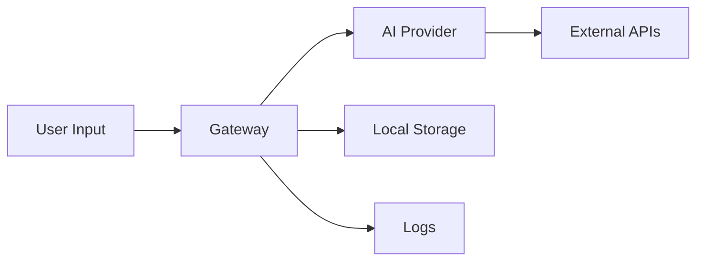

# ISSUE 2 — Data Exfiltration & Privacy Assessment

**Status**: ⏳ **PENDING**

**Assessment Date**: TBD  
**Assessor**: TBD  
**Review Date**: TBD

---

## Executive Summary

[To be completed during assessment]

**Overall Risk Rating**: TBD

**Critical Findings**: TBD

**High Priority Recommendations**: TBD

---

## 1. Scope & Methodology

### Assessment Scope

This assessment focuses on:
- Data flow analysis (where does user data go?)
- PII handling and exposure
- Logging safety (credential leakage)
- Network egress monitoring
- Third-party data sharing
- Local data storage security
- Session data persistence

### Methodology

- Data flow mapping
- Network traffic analysis
- Log file inspection
- Storage security review
- API endpoint analysis
- Third-party integration review

### Tools Used

- [ ] Network analysis: Wireshark, mitmproxy
- [ ] Log analysis: grep, custom scripts
- [ ] Storage inspection: file system auditing
- [ ] API testing: Burp Suite, Postman

---

## 2. Detailed Findings

### Finding Template

#### CLAW-D-001: [Finding Title]

**Severity**: [Critical / High / Medium / Low]  
**CVSS Score**: [X.X]  
**Status**: [Identified / Mitigated / Accepted]

**Description**:
[Detailed description of the data exposure vulnerability]

**Data at Risk**:
- Type: [PII / Credentials / API Keys / Session Data]
- Volume: [Estimate]
- Sensitivity: [High / Medium / Low]

**Exposure Vector**:
```
[How data can be accessed or exfiltrated]
```

**Affected Components**:
- File: `path/to/file.ts:line-number`
- API: [endpoint]
- Storage: [location]

**Proof of Concept**:
```bash
# Steps to demonstrate data exposure
```

**Impact**:
- **Privacy**: [GDPR/CCPA compliance impact]
- **Regulatory**: [Compliance violations]
- **Reputational**: [Brand impact]
- **Financial**: [Potential costs]

**Current Mitigation**: [None / Partial / Describe existing controls]

**Recommendation**:
1. [Specific fix #1]
2. [Specific fix #2]
3. [Verification step]

**Effort**: [X hours/days]  
**Priority**: [Immediate / Short-term / Medium-term]

---

## 3. Data Flow Analysis

### User Data Flows



### PII Inventory

| Data Type | Source | Storage | Transmission | Retention | Risk |
|-----------|--------|---------|--------------|-----------|------|
| Chat messages | User input | Local DB | TLS to AI API | Configurable | High |
| API keys | Config | File system | N/A | Persistent | Critical |
| IP addresses | Network | Logs | Varies | 30 days | Medium |

---

## 4. Privacy Risk Matrix

| Risk ID | Data Type | Exposure Vector | Severity | Likelihood | Overall Risk |
|---------|-----------|-----------------|----------|------------|--------------|
| CLAW-D-001 | API Keys | Log files | Critical | High | **Critical** |
| CLAW-D-002 | Chat history | Unencrypted storage | High | Medium | **High** |

### Critical Privacy Concerns

1. **[Concern #1]**: Description
2. **[Concern #2]**: Description

---

## 5. Logging Safety Analysis

### Credential Leakage Risks

**Locations to audit**:
- [ ] Application logs: `~/.openclaw/logs/`
- [ ] System logs: `/var/log/`
- [ ] Debug output: console logs
- [ ] Error tracking: external services

**Types of secrets at risk**:
- API tokens
- Session IDs
- Database credentials
- SSH keys
- OAuth tokens

### Log Redaction Status

| Log Type | PII Risk | Redaction Status | Recommendation |
|----------|----------|------------------|----------------|
| Debug logs | High | None | Implement redaction |
| Error logs | Medium | Partial | Enhance filters |
| Access logs | Low | Good | Maintain |

---

## 6. Data Storage Security

### Local Storage Locations

| Location | Data Type | Encryption | Permissions | Risk |
|----------|-----------|------------|-------------|------|
| `~/.openclaw/config/` | Config, tokens | None | 0600 | High |
| `~/.openclaw/sessions/` | Chat history | None | 0700 | Medium |
| `~/.openclaw/credentials/` | API keys | None | 0600 | Critical |

### Storage Recommendations

1. **Encryption at rest**: Implement for sensitive data
2. **File permissions**: Audit and restrict
3. **Secure deletion**: Implement for removed credentials

---

## 7. Network Egress Analysis

### External Connections

| Destination | Purpose | Data Sent | Protocol | Risk |
|-------------|---------|-----------|----------|------|
| OpenAI API | LLM inference | User messages | HTTPS | Medium |
| Anthropic API | LLM inference | User messages | HTTPS | Medium |
| Telemetry | Usage stats | Metadata | HTTPS | Low |

### Egress Control Recommendations

- [ ] Implement network policy rules
- [ ] Add proxy support for corporate environments
- [ ] Enable egress logging
- [ ] Provide offline mode

---

## 8. Third-Party Data Sharing

### AI Provider Data Policies

| Provider | Data Retention | Training Use | Privacy Policy |
|----------|----------------|--------------|----------------|
| OpenAI | 30 days | Opt-out available | [Link] |
| Anthropic | None (by default) | No | [Link] |
| Google | Varies | Opt-out required | [Link] |

### Compliance Considerations

- **GDPR**: [Assessment]
- **CCPA**: [Assessment]
- **HIPAA**: [Assessment]
- **SOC2**: [Assessment]

---

## 9. Recommendations Summary

### Immediate Actions (1-3 Days)

1. **Remove credentials from logs**
   - Risk: Critical
   - Effort: 4 hours
   - Impact: Prevent credential leakage

2. **Encrypt stored API keys**
   - Risk: Critical
   - Effort: 8 hours
   - Impact: Protect credentials at rest

### Short-Term Actions (1-2 Weeks)

1. **Implement log redaction**
   - Risk: High
   - Effort: 3 days
   - Impact: Prevent PII exposure

2. **Add data retention policies**
   - Risk: High
   - Effort: 2 days
   - Impact: Compliance improvement

### Medium-Term Actions (1 Month)

1. **Build privacy dashboard**
   - Risk: Medium
   - Effort: 1 week
   - Impact: User transparency

2. **Implement data export/deletion**
   - Risk: Medium
   - Effort: 1 week
   - Impact: GDPR compliance

---

## 10. Verification Procedures

### Automated Tests

```bash
# Test log redaction
npm test -- log-redaction.test.ts

# Test storage encryption
npm test -- storage-security.test.ts

# Test data deletion
npm test -- data-retention.test.ts
```

### Manual Verification

- [ ] Inspect logs for credentials
- [ ] Check file permissions on sensitive data
- [ ] Verify encryption implementation
- [ ] Test data export functionality
- [ ] Confirm retention policy enforcement

---

## 11. References

### Related Security Documentation
- [Security Policy](../../../SECURITY.md)
- [Privacy Policy]: TBD
- [Data Processing Agreement]: TBD

### Standards & Best Practices
- GDPR Articles 32, 33, 34
- CCPA §§ 1798.100-1798.199
- OWASP Data Protection Cheat Sheet
- CWE-312: Cleartext Storage of Sensitive Information
- CWE-532: Insertion of Sensitive Information into Log File

---

**Document Status**: Template - Awaiting Assessment  
**Last Updated**: 2026-02-11  
**Next Review**: After assessment completion
