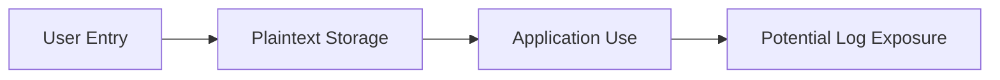
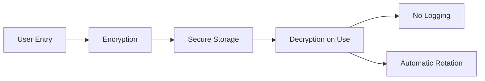

# ISSUE 3 — Secrets & Credential Management Assessment

**Status**: ⏳ **PENDING**

**Assessment Date**: TBD  
**Assessor**: TBD  
**Review Date**: TBD

---

## Executive Summary

[To be completed during assessment]

**Overall Risk Rating**: TBD

**Critical Findings**: TBD

**High Priority Recommendations**: TBD

---

## 1. Scope & Methodology

### Assessment Scope

This assessment focuses on:
- Secrets storage mechanisms
- Credential lifecycle management
- API key rotation capabilities
- Secrets in code/config/environment
- Third-party secret managers integration
- Credential leak vectors
- Key derivation and encryption

### Methodology

- Secret scanning (automated + manual)
- Storage location audit
- Access control review
- Encryption implementation review
- Credential rotation testing
- Secrets management best practices comparison

### Tools Used

- [ ] Secret scanning: detect-secrets, truffleHog, GitLeaks
- [ ] Static analysis: Semgrep, CodeQL
- [ ] Configuration audit: custom scripts
- [ ] Access testing: permission analysis

---

## 2. Detailed Findings

### Finding Template

#### CLAW-S-001: [Finding Title]

**Severity**: [Critical / High / Medium / Low]  
**CVSS Score**: [X.X]  
**Status**: [Identified / Mitigated / Accepted]

**Description**:
[Detailed description of the secrets management vulnerability]

**Credential Type**:
- [ ] API Key
- [ ] OAuth Token
- [ ] Password
- [ ] SSH Key
- [ ] Database Credential
- [ ] Session Token
- [ ] Encryption Key

**Exposure Vector**:
```
[How the credential can be compromised]
```

**Affected Components**:
- File: `path/to/file.ts:line-number`
- Storage: [location]
- Access: [who can access]

**Proof of Concept**:
```bash
# Steps to access the credential
```

**Impact**:
- **Authentication Bypass**: [Yes/No]
- **Privilege Escalation**: [Yes/No]
- **Data Access**: [Level of access gained]
- **System Compromise**: [Scope]

**Current Mitigation**: [None / Partial / Describe existing controls]

**Recommendation**:
1. [Specific fix #1]
2. [Specific fix #2]
3. [Verification step]

**Effort**: [X hours/days]  
**Priority**: [Immediate / Short-term / Medium-term]

---

## 3. Secrets Inventory

### Storage Locations

| Secret Type | Location | Format | Encryption | Access Control | Risk |
|-------------|----------|--------|------------|----------------|------|
| AI API Keys | `~/.openclaw/credentials/` | JSON | None | User only (0600) | Critical |
| Session tokens | Memory | In-memory | N/A | Process only | Low |
| OAuth tokens | Local DB | Plaintext | None | User only | High |
| SSH keys | `~/.ssh/` | PEM | Passphrase optional | User only | Medium |

### Secrets in Source Code

**Search Results**:
```bash
# Command used
detect-secrets scan --baseline .secrets.baseline

# Findings
[List any hardcoded secrets or false positives]
```

---

## 4. Risk Assessment

### Credential Risk Matrix

| Risk ID | Secret Type | Storage | Access | Rotation | Overall Risk |
|---------|-------------|---------|--------|----------|--------------|
| CLAW-S-001 | API Keys | Plaintext file | Weak | Manual only | **Critical** |
| CLAW-S-002 | OAuth tokens | Plaintext DB | Good | Automatic | **Medium** |

### High-Risk Scenarios

1. **Scenario 1**: [Attacker gains file system access]
   - Exposed: All API keys
   - Impact: Full account compromise
   - Likelihood: Medium

2. **Scenario 2**: [Log file exposure]
   - Exposed: Session tokens
   - Impact: Account takeover
   - Likelihood: High

---

## 5. Secrets Lifecycle

### Current State



### Recommended State



### Lifecycle Gaps

- [ ] **Generation**: [Assessment of secret generation security]
- [ ] **Storage**: [Assessment of storage security]
- [ ] **Distribution**: [Assessment of distribution methods]
- [ ] **Rotation**: [Assessment of rotation capabilities]
- [ ] **Revocation**: [Assessment of revocation processes]
- [ ] **Destruction**: [Assessment of secure deletion]

---

## 6. Encryption Analysis

### Current Encryption

| Data | Encryption Method | Key Management | Assessment |
|------|-------------------|----------------|------------|
| API Keys | None | N/A | ❌ Vulnerable |
| Config Files | None | N/A | ❌ Vulnerable |
| Session Data | None | N/A | ⚠️ Risk |

### Recommended Encryption

**At Rest**:
- Algorithm: AES-256-GCM
- Key derivation: PBKDF2 or Argon2
- Key storage: OS keychain integration

**In Transit**:
- TLS 1.3 for all network communication
- Certificate pinning for critical endpoints

---

## 7. Secret Manager Integration

### Current State

- [ ] OS Keychain: Not integrated
- [ ] HashiCorp Vault: Not supported
- [ ] AWS Secrets Manager: Not supported
- [ ] Azure Key Vault: Not supported
- [ ] 1Password CLI: Not supported

### Integration Recommendations

**Priority 1**: OS Keychain (macOS/Windows/Linux)
- Effort: 1 week
- Impact: Significant security improvement
- Platform: All

**Priority 2**: HashiCorp Vault
- Effort: 2 weeks
- Impact: Enterprise deployment enablement
- Platform: All

**Priority 3**: Cloud provider integration
- Effort: 1 week per provider
- Impact: Cloud-native deployment support
- Platform: AWS, Azure, GCP

---

## 8. Access Control

### Current Access Model

| Secret | Who Has Access | How | Risk |
|--------|----------------|-----|------|
| Config files | File owner, root | File system | Medium |
| Environment vars | Process, parent processes | Process table | High |
| Credentials store | File owner, root | File system | High |

### Recommended Access Model

- Principle of least privilege
- Role-based access control
- Audit logging for secret access
- Time-limited credentials
- MFA for high-value operations

---

## 9. Rotation & Expiration

### Current Capabilities

- [ ] **Automatic rotation**: Not implemented
- [ ] **Expiration policies**: Not enforced
- [ ] **Rotation reminders**: Not available
- [ ] **Zero-downtime rotation**: Not supported

### Rotation Strategy

**Immediate Priority**:
1. Implement expiration tracking
2. Add rotation reminders
3. Document manual rotation process

**Short-term**:
1. Build automatic rotation for supported providers
2. Add rotation UI/CLI commands
3. Implement zero-downtime rotation

**Long-term**:
1. Enforce rotation policies
2. Auto-rotate on security events
3. Integration with secret managers

---

## 10. Recommendations Summary

### Immediate Actions (1-3 Days)

1. **Encrypt stored credentials**
   - Risk: Critical
   - Effort: 8 hours
   - Impact: Protect secrets at rest

2. **Audit and remove hardcoded secrets**
   - Risk: Critical
   - Effort: 4 hours
   - Impact: Eliminate code exposure

### Short-Term Actions (1-2 Weeks)

1. **Integrate OS keychain**
   - Risk: High
   - Effort: 1 week
   - Impact: Native platform security

2. **Implement credential rotation**
   - Risk: High
   - Effort: 1 week
   - Impact: Reduce exposure window

3. **Add secrets auditing**
   - Risk: High
   - Effort: 3 days
   - Impact: Detect unauthorized access

### Medium-Term Actions (1 Month)

1. **Support Vault integration**
   - Risk: Medium
   - Effort: 2 weeks
   - Impact: Enterprise readiness

2. **Build credential management UI**
   - Risk: Medium
   - Effort: 1 week
   - Impact: Improved UX and security

---

## 11. Verification Procedures

### Automated Tests

```bash
# Test encryption
npm test -- credentials-encryption.test.ts

# Test rotation
npm test -- credential-rotation.test.ts

# Scan for hardcoded secrets
detect-secrets scan --baseline .secrets.baseline

# Test access controls
npm test -- secrets-access.test.ts
```

### Manual Verification

- [ ] Verify credentials encrypted at rest
- [ ] Confirm no secrets in logs
- [ ] Test rotation process
- [ ] Verify keychain integration
- [ ] Check file permissions
- [ ] Audit access logs

---

## 12. References

### Related Security Documentation
- [Security Policy](../../../SECURITY.md)
- [CLI Security](../../cli/security.md)
- [Gateway Security](../../gateway/security/index.md)

### Standards & Best Practices
- OWASP Secrets Management Cheat Sheet
- CWE-259: Use of Hard-coded Password
- CWE-798: Use of Hard-coded Credentials
- CWE-522: Insufficiently Protected Credentials
- NIST SP 800-57: Key Management

### Tools
- detect-secrets: https://github.com/Yelp/detect-secrets
- git-secrets: https://github.com/awslabs/git-secrets
- TruffleHog: https://github.com/trufflesecurity/trufflehog

---

**Document Status**: Template - Awaiting Assessment  
**Last Updated**: 2026-02-11  
**Next Review**: After assessment completion
